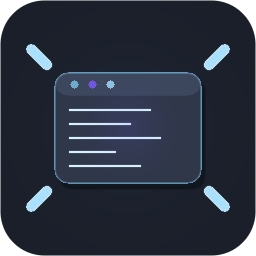

# Max Editor for VS Code

Maximize the editor by hiding all VS Code side panels with a single click (or keyboard shortcut), then restore everything exactly as it was.

<br clear="left" />

## Features

- **One-click maximize** — hides the sidebar, bottom panel, secondary sidebar, activity bar, and status bar
- **One-click restore** — brings everything back to the state it was in before maximizing
- **Editor title button** — maximize/restore icon lives directly in the editor tab bar (the `⛶` / restore icon)
- **Status bar button** — always-visible toggle in the bottom-right corner
- **Keyboard shortcut** — `Cmd+Shift+M` (Mac) / `Ctrl+Shift+M` (Windows/Linux)

## Requirements

- VS Code **1.104** or newer

## Commands

- **Max Editor: Toggle Maximize Editor** — toggles between maximized and normal layout

## Keyboard Shortcuts

| Shortcut | Action |
| --- | --- |
| `Cmd+Shift+M` / `Ctrl+Shift+M` | Toggle maximize |

## Development

```bash
npm install
npm run compile      # one-shot bundle to dist/extension.js
npm run watch        # incremental rebuild
node scripts/generate-icon.js  # regenerate media/icon.png
npm run package:vsix # produce a .vsix to install locally
```

Press `F5` in VS Code to launch an Extension Development Host with the extension active.

## How it works

When you maximize, the extension runs the following workbench commands to hide all panels:

```
workbench.action.closeSidebar
workbench.action.closePanel
workbench.action.closeAuxiliaryBar
workbench.action.activityBarLocation.hide
workbench.action.statusBar.hide
```

It saves the layout state before hiding, so restore knows exactly which panels to bring back. Focus is always returned to the active editor group after restore.

## License

MIT
