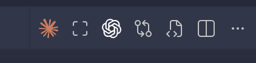
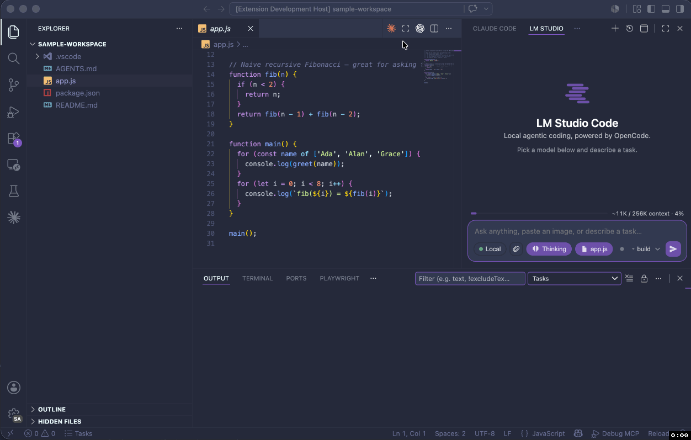

<table border="0" cellpadding="0" cellspacing="0"><tr>
<td width="112"></td>
<td><h1>Max Editor for VS Code</h1>Maximize the editor by hiding all VS Code side panels with a single click (or keyboard shortcut), then restore everything exactly as it was.</td>
</tr></table>

## Features

- **One-click maximize** — hides the sidebar, bottom panel, and secondary sidebar
- **One-click restore** — brings back only the panels that were open before maximizing
- **Editor title button** — maximize/restore icon lives directly in the editor tab bar
- **Keyboard shortcut** — `Cmd+Shift+M` (Mac) / `Ctrl+Shift+M` (Windows/Linux)
- **No native dependencies** — pure JavaScript, works across all VS Code versions

## Usage

Press `Cmd+Shift+M` (Mac) or `Ctrl+Shift+M` (Windows/Linux), or click the maximize button in the editor title bar (shown circled below):





The extension reads your panel state when VS Code opens, hides everything on maximize, and restores only the panels that were originally visible on restore.

## Requirements

- VS Code **1.104** or newer

## Commands

- **Max Editor: Toggle Maximize Editor** — toggles between maximized and normal layout

## Keyboard Shortcuts

| Shortcut | Action |
| --- | --- |
| `Cmd+Shift+M` / `Ctrl+Shift+M` | Toggle maximize |

## Known Limitation: Panel State Tracking

> **Note:** VS Code does not currently expose a public API for reading whether the sidebar, bottom panel, or auxiliary bar are visible at runtime.

To work around this, Max Editor reads VS Code's internal storage database (`state.vscdb`) at startup to seed the initial panel state. This works correctly in the common case — but if you **manually toggle a panel after opening VS Code and before pressing maximize**, the extension won't detect that change, and may incorrectly restore that panel on unmaximize.

**We've filed a feature request with the VS Code team** to expose this information through the public Extension API:
- Issue: [microsoft/vscode#321409](https://github.com/microsoft/vscode/issues/321409)
- PR: [microsoft/vscode#321414](https://github.com/microsoft/vscode/pull/321414)

Once that API ships, Max Editor will be updated to track panel state perfectly in real time.

**Workaround for now:** if you manually toggle panels before maximizing, toggle them back first, then use Max Editor — the startup-probed state will be accurate.

## How it works

At activation, the extension probes VS Code's workspace storage database to read the last-known visibility of each panel. When you maximize:

1. The current layout is saved
2. `workbench.action.closeSidebar`, `workbench.action.closePanel`, and `workbench.action.closeAuxiliaryBar` are run to hide all panels
3. Focus returns to the active editor

On restore, only the panels that were open before maximizing are brought back.

## Development

```bash
npm install
npm run compile      # one-shot bundle to dist/extension.js
npm run watch        # incremental rebuild
npm run test:unit    # run SQLite reader unit tests (no VS Code host needed)
npm test             # full integration test suite
npm run package:vsix # produce a .vsix to install locally
```

Press `F5` in VS Code to launch an Extension Development Host with the extension active.

## License

MIT
